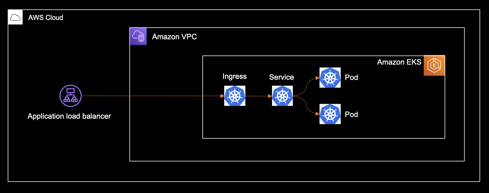

# Kubernetes End-2-End | AWS

Example of how to define and deploy a cdk8s application onto an Amazon EKS cluster. 

At a high-level, it consists of:

- An Amazon EKS cluster defined with the AWS CDK.
- A Kubernetes workload defined with cdk8s.

Everything is deployed via the AWS CDK, which can natively integrate with cdk8s to 
deploy Kubernetes manifests.

> More detailed information is available inline with the [code](./index.ts).

## Architecture



## Including Application Code (Optional)

AWS CDK can build docker images and upload it to an ECR repository. This allows us 
to deploy local application code as well, not just images hosted on remote registries.

If our application code is stored for example in a `server/server.js` file, we can create 
a docker image from it using the AWS CDK:

```ts
import * as ecr from 'aws-cdk-lib/aws-ecr-assets';
import * as path from 'path';

const image = new ecr.DockerImageAsset(this, 'Image', {
  directory: path.join(__dirname, 'server'),
});
image.repository.grantPull(cluster.defaultNodegroup!.role)
```

Now, instead of hard coding an image URI, you can pass a deploy time value to cdk8s:

```ts
const deployment = new kplus.Deployment(chart, 'Deployment', {
  containers: [{
    image: image.imageUri, // deploy time value
    portNumber: 8080,
  }],
});
```

## Imported Clusters (Optional)

In some cases, the pipeline that creates the EKS cluster will not be the same as the
one that deploys the Kubernetes application. That is, a cluster may have already been
provisioned when it comes time for the application pipeline to run.

To support this use-case, you can use [imported clusters](https://github.com/aws/aws-cdk/tree/main/packages/%40aws-cdk/aws-eks#using-existing-clusters).

```ts
const cluster = eks.Cluster.fromClusterAttributes(this, 'Cluster', {
  clusterName: 'my-cluster-name',
  kubectlRoleArn: 'arn:aws:iam::1111111:role/iam-role-that-has-masters-access',
});
```

With this code, a new EKS cluster will not be provisioned. Instead, the existing cluster
is referenced, and is used to apply Kubernetes manifests to.

## Deploy

```console
git clone https://github.com/cdk8s-team/cdk8s-examples.git
```

```console
cd cdk8s-examples/typescript/kubernetes-end-to-end-aws
```

```console
npm install
```

```console
npm run deploy
```

## Destroy 

```console
npm run destroy
```
